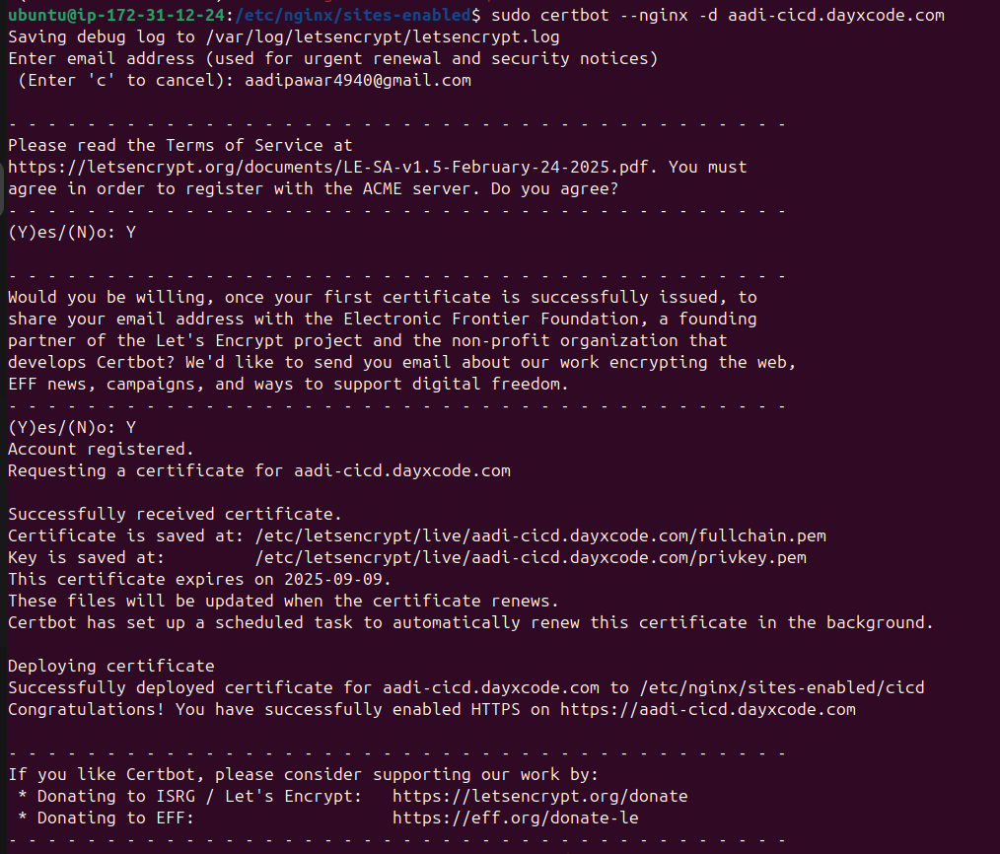

# GitHub Action CICD Implementation for Next.js Project


---

## Nginx Configuration Steps

```bash
sudo apt update
sudo apt install nginx
sudo vim /etc/nginx/sites-available/cicd
```

```nginx
server {
    listen 80;
    server_name aadi-cicd.dayxcode.com;

    location / {
        proxy_pass http://localhost:3000;
        proxy_set_header Host $host;
        proxy_set_header X-Real-IP $remote_addr;
        proxy_set_header X-Forwarded-For $proxy_add_x_forwarded_for;
        proxy_set_header X-Forwarded-Proto $scheme;

        proxy_http_version 1.1;
        proxy_set_header Upgrade $http_upgrade;
        proxy_set_header Connection "upgrade";
    }
}
```

```bash
# Create symlink in sites-enabled
tsudo ln -s /etc/nginx/sites-available/cicd /etc/nginx/sites-enabled/

# Test and reload Nginx
sudo nginx -t
sudo systemctl restart nginx
```

---

## Enable HTTPS with Let's Encrypt + Certbot

Reference: [DigitalOcean Guide](https://www.digitalocean.com/community/tutorials/how-to-secure-nginx-with-let-s-encrypt-on-ubuntu-20-04)

```bash
sudo apt update
sudo apt install certbot python3-certbot-nginx

# Issue SSL certificate
sudo certbot --nginx -d aadi-cicd.dayxcode.com
```

---

## Results

### SSL Certificate Generated



### Updated Nginx Configuration (Post-Certbot)


### Final Deployed NextJs Website with HTTPS:


